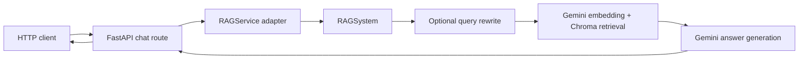
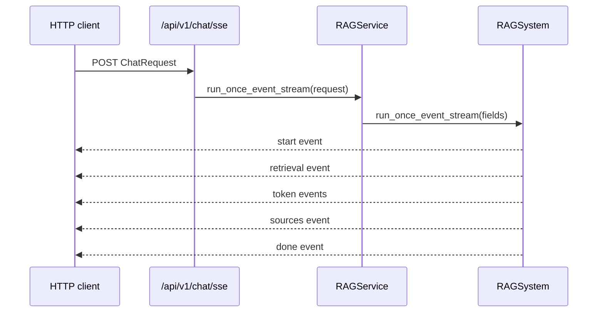

# Backend Repair Record

## Scope

This repair changes only the Python backend. No file under `frontend/` was
modified, and no endpoint or product feature was added.

## Confirmed Problems

### 1. Missing SSE service method

`POST /api/v1/chat/sse` called
`RAGService.run_once_event_stream(request)`, but `RAGService` did not define
that method. Any request reaching the endpoint would fail with an
`AttributeError` before the RAG event stream could run.

### 2. Streaming generation used the client variable directly

`RAGSystem.generate_answer_stream()` accessed `gemini_client.models`
directly. The application intentionally creates the Gemini client lazily via
`get_gemini_client()`, so direct access could fail with an `AttributeError`
when the stream method was called before another operation initialized the
client.

### 3. The current corpus is empty

The backend startup lifecycle loads text files from `data/` when the Chroma
collection is empty. At the time of this repair, all three source files are
zero bytes:

- `data/embeedings.txt`
- `data/rag_basics.txt`
- `data/vector_bases.txt`

The backend process can start and `/health` returns HTTP 200, but `/ready`
correctly returns HTTP 503 because no chunks can be created or stored. This is
an input-data condition, not a code failure. No placeholder knowledge was
added because doing so would change the application's content and behavior.

## Changes Made

### `app/services/rag_services.py`

Added `RAGService.run_once_event_stream()`. It follows the same adapter pattern
as the existing synchronous and plain-text streaming methods:

1. Convert each Pydantic chat-history message to a dictionary.
2. Forward every existing request option to
   `RAGSystem.run_once_event_stream()`.
3. Return the existing generator to the SSE route.

### `phase1.py`

Changed streaming generation to obtain the Gemini client through
`get_gemini_client()`. This makes the streaming path follow the backend's
existing lazy-initialization design.

## Backend Request Flow



The SSE path now resolves as follows:



## Startup and Readiness

The lifecycle is:

```mermaid
flowchart TD
    Start[FastAPI lifespan starts] --> Store[Open Chroma collection]
    Store --> Count{Collection has chunks?}
    Count -- Yes --> Service[Create RAGService]
    Count -- No --> Load[Load data/*.txt]
    Load --> Ingest[Chunk, embed, and ingest non-empty text]
    Ingest --> Service
    Service --> Ready{Collection count greater than zero?}
    Ready -- Yes --> R200[/ready returns 200]
    Ready -- No --> R503[/ready returns 503]
```

For the current checkout, startup reaches the last `No` branch because the
text files are empty. Add the intended project content to those existing files
and restart the backend to allow ingestion and readiness to complete. A valid
`GEMINI_API_KEY` is also required for embedding and chat requests.

## Validation Performed

- Imported the FastAPI application successfully with Python 3.13.5.
- Started the application lifespan using FastAPI's test client.
- Started a real Uvicorn process on `127.0.0.1:8011` and confirmed application
  startup completed without an exception; the process was stopped after the
  smoke test.
- Confirmed `GET /health` returns HTTP 200 with `{"status":"ok"}`.
- Confirmed the existing empty corpus produces HTTP 503 from `GET /ready`.
- Verified the API schema contains the synchronous, plain streaming, and SSE
  chat endpoints.
- Verified the repaired SSE service adapter forwards all `ChatRequest` fields
  to the RAG pipeline.

No live Gemini generation request was made during validation.
