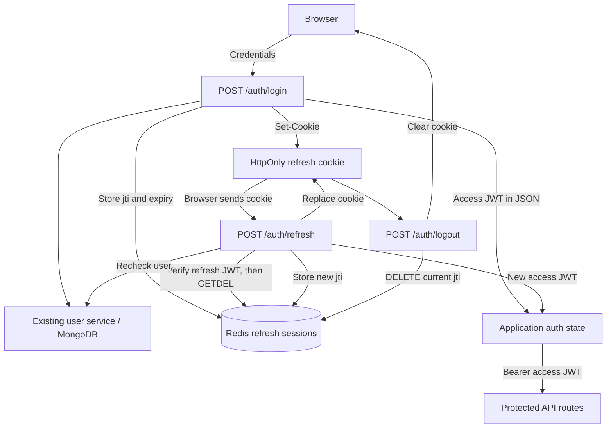

**Phase 3.4: refresh tokens and Redis sessions**

The implementation separates permission to make an API request from permission to renew that access. An access JWT lasts 900 seconds. A refresh JWT lasts 604800 seconds (7 days), and is usable only while its Redis entry exists. Each successful refresh replaces both tokens. Existing chat request bodies, RAG methods, and SSE events are unchanged.



All auth paths in the diagram have the `/api/v1` prefix. Redis holds the current refresh permission, not the raw JWT:

```text
key:        auth:refresh:<jti>
value:      authenticated user_id
expiration: refresh JWT exp, expressed as Unix seconds
```

`jti` is the JWT's unique token identifier. It is a newly generated UUID for every token, not a user ID or a conversation ID. Several devices can have different refresh JTIs for the same user. A normal access-token request does not look up any refresh JTI in Redis. The existing MongoDB user lookup in `get_current_user()` still runs.

**Login follows this request flow.**

1. `POST /api/v1/auth/login` receives the existing username/password JSON.
2. The existing authentication service verifies the credentials and enabled account.
3. If this browser already supplies a valid refresh cookie, its old Redis entry is revoked. This avoids leaving an active token behind when login replaces the cookie.
4. The server creates a 15-minute access JWT and a 7-day refresh JWT with distinct JTIs and token types.
5. The refresh service executes `SET auth:refresh:<jti> <user_id> EXAT <exp> NX`. The session must be stored successfully before credentials are delivered to the browser.
6. The response sets the refresh cookie and returns the existing JSON contract:

```json
{
  "access_token": "<access JWT>",
  "token_type": "bearer",
  "expires_in": 900
}
```

The refresh JWT is absent from this JSON. Successful token responses use `Cache-Control: no-store` and `Pragma: no-cache`. Invalid login credentials still return 401. Redis failures return 503 without returning a new access token or refresh cookie.

**Refresh follows this request flow.**

1. `POST /api/v1/auth/refresh` reads only the `refresh_token` cookie. A Bearer token or JSON field does not substitute for that cookie.
2. `decode_refresh_token()` verifies the signature, allowed algorithm, issuer, audience, expiration, issue time, required claims, and `type == "refresh"`.
3. `GETDEL auth:refresh:<jti>` atomically retrieves and removes the old session.
4. An absent entry means expired, revoked, already consumed, or unknown session. It returns 401. The stored user ID must also equal the verified JWT subject; a mismatch returns 401.
5. MongoDB is queried again. A missing or disabled user receives 401, and the consumed session stays invalid.
6. The server issues a new access JWT and refresh JWT with a new JTI, stores the replacement Redis entry, sets the replacement cookie, and returns access-token JSON.
7. Invalid or unusable refresh sessions receive a cookie deletion header. Infrastructure failures are distinct: Redis failure is 503, never an authorization bypass.

After `R1 -> R2`, replaying R1 fails. After `R2 -> R3`, replaying R2 fails. Each replacement has a new 7-day lifetime; there is no absolute maximum login lifetime in this phase.

**Logout follows this request flow.**

1. `POST /api/v1/auth/logout` reads the refresh cookie.
2. If it contains a verifiable, unexpired refresh JWT, the server deletes `auth:refresh:<jti>`.
3. Missing, invalid, expired, or already-revoked cookies are safe to log out: the response still clears the cookie and returns 204 with no body.
4. If Redis cannot confirm deletion for a valid token, logout returns 503 and keeps the cookie so the browser can retry. It does not claim successful server-side revocation. A timeout can also mean Redis performed the operation but its reply was lost.
5. The frontend should discard its in-memory access token on logout and handle unsuccessful server revocation explicitly.

**The lifetime split controls different risks.** Short access lifetimes bound how long a stolen access JWT can be used, without requiring a Redis lookup on every API request. Refresh tokens allow users to stay signed in without repeatedly submitting passwords. Their longer lifetime and ability to mint new access tokens make them more valuable credentials, so they receive stronger browser protection and server-side state checks. Shorter lifetimes reduce exposure but increase refresh traffic or login frequency; longer lifetimes improve continuity but increase the window of misuse.

JWT verification proves that a token was signed by this application and has valid claims. It does not prove the session is still allowed. Redis supplies that extra decision: even a correctly signed, unexpired refresh JWT fails when its entry is missing. Deleting the entry revokes renewal permission. The UUID alone cannot mint a refresh JWT without the signing secret.

The access and refresh decoders are separate public methods. Both share private verification code, but each fixes its required token type. This prevents a seven-day refresh token from accidentally becoming a seven-day Bearer credential on protected routes. Both tokens require `sub`, `type`, `iat`, `exp`, `iss`, `aud`, and `jti`; this issuer uses integer NumericDates.

**Atomic consumption prevents two successful rotations.** With separate commands, both A and B could read R1 before either deletes it, and both could create successors. A single GETDEL is the claim on the old session:

| Operation | Request A | Request B |
| --- | --- | --- |
| `GETDEL R1` | Returns `alice`; removes R1 | Returns no value |
| Result | May issue R2 | 401; no tokens issued |

The winning request can still fail later because user lookup, Redis storage, or the network fails. Atomic consumption guarantees at most one winner, not guaranteed delivery of a successor. R1 is deliberately never restored after consumption. Restoring it would reopen replay. Redis command retries are disabled because silently repeating GETDEL after a lost reply could turn an already-consumed token into an ambiguous failure. See the [Redis GETDEL documentation](https://redis.io/docs/latest/commands/getdel/).

TTL is automatic server-side cleanup, not a background task maintained by FastAPI. The service uses `EXAT=claims["exp"]` so Redis expires the key at the JWT's absolute deadline. Using a fresh seven-day relative TTL after a slow operation would let the key outlive the token. Cookie Max-Age is calculated from the remaining lifetime; JWT verification and Redis expiry remain authoritative. Application and Redis clocks should be synchronized. See [Redis SET expiration options](https://redis.io/docs/latest/commands/set/).

**Cookie protection addresses browser exposure.** The cookie configuration is:

| Setting | Value | Purpose |
| --- | --- | --- |
| Name | `refresh_token` | The refresh route reads this cookie |
| HttpOnly | true | JavaScript cannot read it through `document.cookie` |
| Secure | true by default | Browser sends it over secure transport |
| SameSite | Strict | Restricts cookie sending to same-site requests |
| Path | `/api/v1/auth` | Avoids sending it to chat endpoints |
| Domain | omitted | Cookie is scoped to the issuing host |
| Max-Age | Remaining JWT lifetime | Browser removes the cookie after expiration |

HttpOnly reduces direct credential theft through injected JavaScript. It does not prevent malicious JavaScript from making requests as the user, and cookie Path is a delivery restriction rather than a complete security boundary. The browser can send an HttpOnly cookie automatically while the frontend never reads its value. Access JWTs remain in application auth state because JavaScript needs them to set the Authorization header. Refresh tokens do not belong in localStorage. See [MDN's cookie attributes](https://developer.mozilla.org/en-US/docs/Web/HTTP/Reference/Headers/Set-Cookie).

Cookies introduce CSRF concerns because a browser may attach them without an explicit Authorization header written by application code. The current Vite setup proxies `/api` through the same browser origin, so this implementation uses a host-only SameSite=Strict cookie and does not enable cross-origin credential sharing. Same-site and same-origin are different concepts: a hostile sibling subdomain can still matter. If the deployment changes to separate sites, reassess SameSite, credentialed CORS, trusted origins, and CSRF defenses together. Merely changing to SameSite=None is insufficient. A full CSRF-token system is outside this phase's current architecture.

**Redis is shared infrastructure.** Lifespan constructs one async client with `decode_responses=True`, finite connection/read timeouts, and automatic command retries disabled. Startup pings it before serving requests. The client and refresh service are stored on application state, reused across requests, and closed with `aclose()` at shutdown. Cleanup also runs if startup or another resource's cleanup fails. MongoDB and RAG initialization remain in place. One client manages a connection pool; creating clients per request would cause needless connection churn and complicate resource cleanup. This follows the [official async redis-py lifecycle guidance](https://redis.io/docs/latest/develop/clients/redis-py/async/).

The `auth:refresh:` namespace separates session records from future `rate_limit:`, `cache:`, or `conversation:` data. These categories have different ownership, expiration, eviction, and deletion rules. Namespaces prevent accidental collisions and overly broad cleanup, but they do not provide resource isolation or an access-control boundary. This phase creates only the refresh namespace.

**Infrastructure errors fail closed.**

| Situation | Behavior |
| --- | --- |
| Redis unavailable during startup | Startup fails; opened resources are closed |
| Redis unavailable during login session creation | 503; no new tokens delivered |
| Redis unavailable during refresh consumption or replacement storage | 503; no new tokens delivered |
| Redis unavailable during valid-token logout | 503; retain cookie for a revocation retry |
| Normal access-token request after a Redis outage | Continues without Redis if its existing dependencies are healthy |
| MongoDB lookup fails after refresh consumption | Request fails; old session remains consumed |

The implementation never falls back to trusting only the refresh JWT when Redis cannot be checked. Session loss through Redis eviction or restart logs users out when they next refresh. Durable production storage/failover policy matters: restoring stale session data can also restore previously consumed or revoked entries. This code does not claim replay guarantees across data rollback or configure deployment durability.

**The implementation is deliberately small.**

| File | Change |
| --- | --- |
| `app/security/jwt.py` | Separate access/refresh creation and decoding; 7-day refresh lifetime |
| `app/security/cookies.py` | Secure configuration plus consistent cookie set/delete helpers |
| `app/services/refresh_token_service.py` | Redis SET with expiry, atomic GETDEL, and DELETE; translates Redis failures |
| `app/routes/auth.py` | Extend login; add refresh/logout; prevent token-response caching |
| `app/main.py` | Initialize and close Redis alongside existing resources |
| `requirements.txt` | Pin official `redis==8.1.0` client |
| `.env.example` | New Redis/cookie settings to merge into existing configuration |
| `tests/redis_double.py` | Isolated Redis behavior with controllable expiry |
| `tests/test_refresh_tokens.py` | Token, cookie, session, concurrency, replay, and failure tests |
| `tests/test_auth.py`, `tests/test_jwt_auth.py` | Adapt existing fixtures and verify lifecycle behavior |

The core Redis operations are:

```python
await redis_client.set(
    "auth:refresh:" + jti,
    user_id,
    exat=expires_at,
    nx=True,
)

stored_user_id = await redis_client.getdel("auth:refresh:" + jti)
await redis_client.delete("auth:refresh:" + jti)
```

`NX` prevents overwriting another session on an identifier collision. The route verifies `stored_user_id == claims["sub"]` after consumption, then calls the existing user service before storing a replacement. No raw refresh JWT or password is stored in Redis.

For local development, install the updated requirements and provide Redis supported by the pinned client (Redis 7.2 or later). GETDEL and SET EXAT themselves were introduced in Redis 6.2, but the current client lists Redis 7.2 and later as supported. The Redis server is a separate prerequisite; installing the Python client does not start a server.

```powershell
.venv\Scripts\python.exe -m pip install -r requirements.txt
$env:REDIS_URL = 'redis://localhost:6379/0'
$env:REFRESH_COOKIE_SECURE = 'false'  # Local HTTP only.
.venv\Scripts\python.exe -m uvicorn app.main:app --reload
```

Retain the existing `JWT_SECRET_KEY`, issuer/audience, MongoDB, and model configuration. No secret values need to be printed or hardcoded. Secure cookies default to true; configure HTTPS and leave that setting true in production. Use your infrastructure's `rediss://` URL and credentials when Redis requires TLS/authentication. `.env.example` contains additions, not a replacement for the existing `.env`.

**Minimal browser integration** uses the existing same-origin proxy. These are integration examples; this phase does not replace the current development token-input UI with a new auth architecture:

```javascript
// Login: JavaScript reads the access token; the browser handles Set-Cookie.
const loginResponse = await fetch('/api/v1/auth/login', {
  method: 'POST',
  credentials: 'same-origin',
  headers: { 'Content-Type': 'application/json' },
  body: JSON.stringify({ username, password }),
});
if (!loginResponse.ok) throw new Error(`Login failed (${loginResponse.status})`);
const { access_token } = await loginResponse.json();
// Put access_token in application auth state, then use Bearer headers.

// After a protected request returns 401, before an SSE stream has begun:
const refreshResponse = await fetch('/api/v1/auth/refresh', {
  method: 'POST',
  credentials: 'same-origin',
});
if (!refreshResponse.ok) throw new Error(`Refresh failed (${refreshResponse.status})`);
const renewed = await refreshResponse.json();
// Update auth state with renewed.access_token and retry an appropriate request once.

const logoutResponse = await fetch('/api/v1/auth/logout', {
  method: 'POST',
  credentials: 'same-origin',
});
// Drop the in-memory access token. A 503 means server revocation needs retrying.
```

Coordinate refresh attempts so only one is in flight per browser session, including across tabs where possible. A losing concurrent request returns 401 and clears its cookie; if that response arrives last, it can clear the winner's replacement cookie. Do not automatically refresh on 403 or replay a partially consumed SSE stream. Do not blindly retry operations with side effects. A refresh 401 requires login; an infrastructure 503 is not proof of bad credentials. There is no automatic frontend refresh/retry implementation in this phase.

**Run the tests without external services.**

```powershell
$env:LANGSMITH_TRACING = 'false'
$env:LANGCHAIN_TRACING_V2 = 'false'
.venv\Scripts\python.exe -m unittest discover -s tests -p test_refresh_tokens.py -v
.venv\Scripts\python.exe -m unittest discover -s tests -v
git diff --check
```

The tests execute real JWT signing/verification and FastAPI requests with isolated Redis and database behavior. Two concurrent HTTP requests present the same cookie and assert exactly one 200 and one 401. Service tests verify the use of GETDEL and exact expiry arguments, so a GET-then-DELETE implementation would not pass. Redis TTL is simulated with a controllable clock; no live Redis, MongoDB, or AI service is required. Existing tenant-authorization and SSE tests remain part of the full suite. Browser cookie attributes are asserted at the HTTP level; deployment-specific browser/CORS behavior is not exercised here.

**Remaining limits are explicit.** Revoking a refresh session does not blacklist an access JWT. An access token issued at 12:00 can remain usable after a 12:02 logout until its 12:15 expiration. The existing user lookup can still reject a disabled/deleted account sooner. Keeping access validation independent of Redis reduces latency and Redis-outage coupling, at the cost of delayed logout enforcement for an already-issued access credential.

This is per-token rotation, not token-family tracking. It rejects replay of R1 but does not revoke an already-issued R2 when R1 is replayed. It cannot distinguish theft from a legitimate duplicate request. Logout revokes the presented token, not every device or a successor created by an already-running refresh; clients must serialize refresh and logout. Stronger family revocation and server-wide logout ordering require more session state and are not implemented here.

Redis consumption, user lookup, successor storage, and HTTP delivery are not one transaction. Crashes, timeouts, or lost responses can require a fresh login; an undelivered successor expires through its TTL. There is no absolute session-age cap, device/session list, full CSRF-token system, or access-token blacklist. Redis durability, failover, TLS, and deployment configuration remain operational responsibilities. No conversation storage, caching, rate limiting, roles, document APIs, or RAG changes were added.
