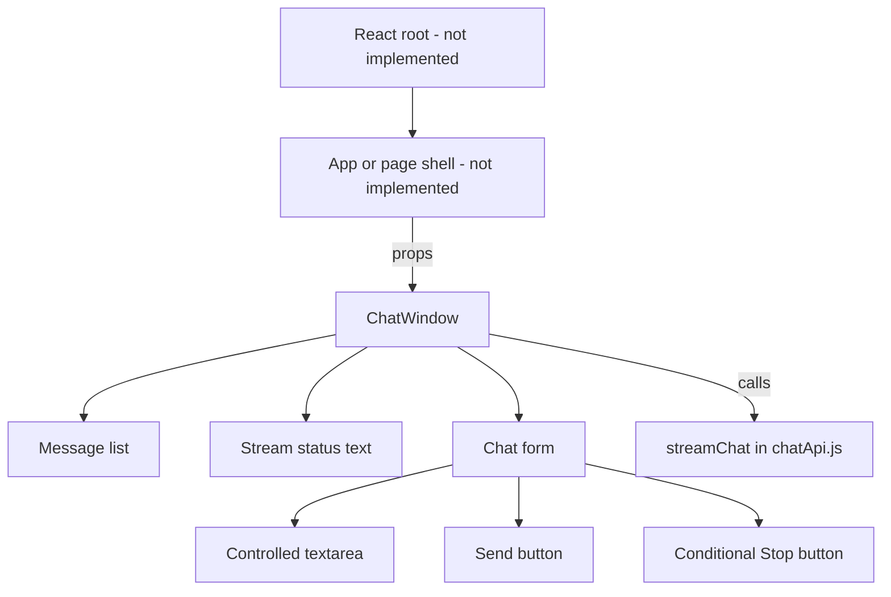
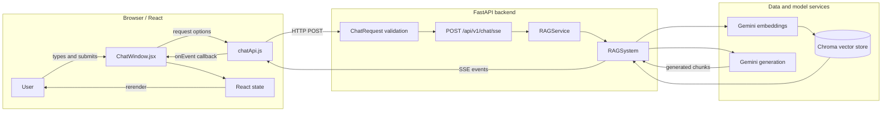
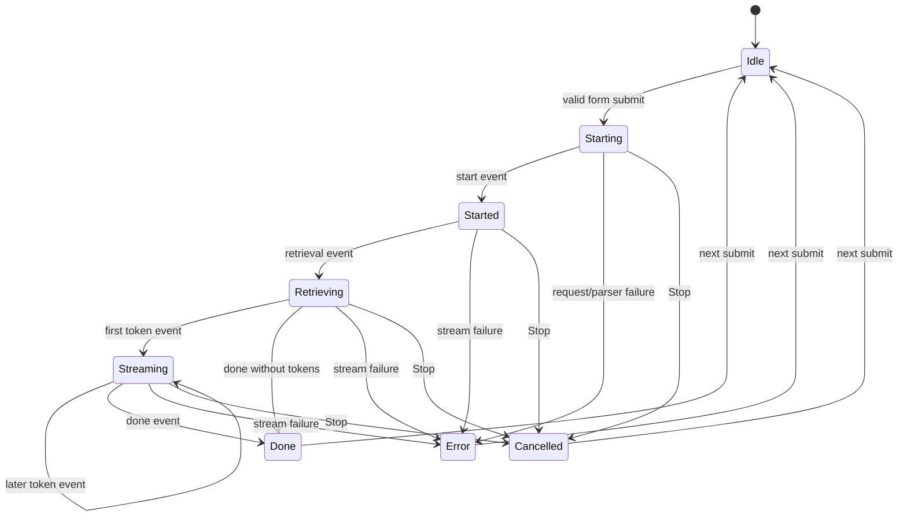
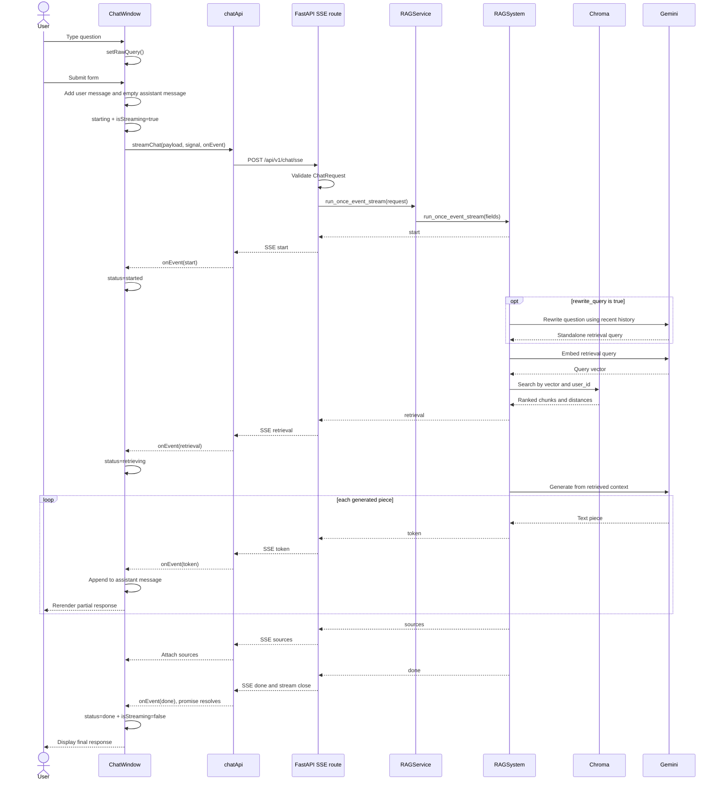

# React UI Architecture and End-to-End Chat Flow

> Historical snapshot: this document describes the frontend before completion.
> The runnable UI, corrected stream decoding, implemented behavior, and remaining
> backend integration work are documented in [FRONTEND_INTEGRATION.md](FRONTEND_INTEGRATION.md).
> The original analysis below is retained for learning context.

## 1. Purpose and Scope

This document explains the current React-side architecture and follows one chat
interaction from the moment a user types a question through the final response
generated by the RAG agent.

It describes the repository as it exists now. The frontend is not yet a
complete runnable React application: it contains the chat component and API
client, but it does not contain `package.json`, `index.html`, `main.jsx`,
`App.jsx`, styling, or a development-server configuration.

## 2. Relevant Project Files

| Layer | File | Responsibility |
| --- | --- | --- |
| UI | `frontend/src/components/chats/ChatWindow.jsx` | Owns chat input, messages, streaming status, cancellation, and rendering |
| Browser API | `frontend/src/api/chatApi.js` | Sends the chat request and converts the response byte stream into SSE events |
| HTTP route | `app/routes/chat.py` | Accepts the validated request and returns server-sent events |
| Request schema | `app/schemas/chat.py` | Defines and validates the request and response data contracts |
| Service adapter | `app/services/rag_services.py` | Converts Pydantic messages to dictionaries and calls the RAG layer |
| RAG pipeline | `phase1.py` | Rewrites, retrieves, generates, and emits the agent response events |
| Application lifecycle | `app/main.py` | Creates the RAG service, loads the corpus, and exposes health/readiness |

## 3. Current React Component Architecture

Only `ChatWindow` exists as a React component in the current repository. A
future application shell must mount it and provide its required configuration.



### Expected `ChatWindow` props

| Prop | Purpose | Backend constraint |
| --- | --- | --- |
| `user_id` | Selects the user's isolated Chroma records | Required, 1-256 characters |
| `chat_history` | Supplies earlier conversation messages | Maximum 20 messages |
| `k` | Controls how many chunks retrieval requests | Integer from 1 through 10 |
| `rewrite_query` | Enables contextual query rewriting | Boolean; backend default is `false` |
| `distance_threshold` | Filters weak vector matches | `null` or a number from 0 through 2 |

There is currently no parent component providing these props. If `user_id` is
`undefined`, `JSON.stringify()` omits it and FastAPI responds with HTTP 422.

## 4. UI Structure

The rendered interface is intentionally small and currently has no styling.

```text
+--------------------------------------------------+
| Message list                                     |
|                                                  |
| user                                             |
| <question text>                                  |
|                                                  |
| assistant                                        |
| <response content as it streams>                 |
+--------------------------------------------------+
| Status: starting / started / retrieving / done   |
+--------------------------------------------------+
| [ textarea                                    ]  |
| [ Send ]  [ Stop - only while streaming ]        |
+--------------------------------------------------+
```

Every message is rendered as a `<div>` containing its role in `<strong>` and
its content in `<p>`. Source metadata is stored on assistant messages but is
not rendered by the current JSX.

## 5. State Ownership

`ChatWindow` is the only owner of interactive UI state.

| State/ref | Initial value | Meaning |
| --- | --- | --- |
| `messages` | `[]` | Locally rendered user and assistant messages |
| `raw_query` | `""` | Current controlled textarea value |
| `isStreaming` | `false` | Prevents duplicate sends and controls Send/Stop buttons |
| `streamStatus` | `null` | Displays the current request phase |
| `abortControllerRef` | `null` | Holds the active request's `AbortController` |

The local `messages` array and the incoming `chat_history` prop are separate.
Newly rendered messages are not automatically added to `chat_history`, so
follow-up requests do not include the visible conversation unless a future
parent component manages and passes updated history.

## 6. System Architecture



## 7. Complete End-to-End UI Flow

### Phase A: User enters a question

1. The user types into the `<textarea>`.
2. `onChange` receives the browser event.
3. `setRawQuery(event.target.value)` updates `raw_query`.
4. React rerenders the controlled textarea with the new value.

### Phase B: React submits optimistically

1. The user submits the form by using the Send button.
2. `handleSubmit()` prevents normal browser form navigation.
3. It trims the query and exits if the result is empty or another stream is
   active.
4. It creates a user message with a browser-generated UUID.
5. It creates an empty assistant placeholder with a second UUID.
6. Both messages are appended to `messages` immediately. This is the
   optimistic UI update; the question appears before the server responds.
7. The textarea is cleared.
8. `isStreaming` becomes `true` and disables Send.
9. `streamStatus` becomes `starting`.
10. An `AbortController` is created, stored in the ref, and supplied to Fetch.

### Phase C: Browser builds the HTTP request

`ChatWindow` calls `streamChat()` with the query, caller-supplied RAG options,
abort signal, and an event callback tied to the assistant placeholder ID.

`chatApi.js` sends:

```http
POST /api/v1/chat/sse
Content-Type: application/json
Accept: text/event-stream
```

```json
{
  "raw_query": "The user's question",
  "user_id": "current-user-id",
  "chat_history": [],
  "k": 3,
  "rewrite_query": false,
  "distance_threshold": null
}
```

The URL is relative, so this works only when the frontend and API share an
origin or when the future frontend development server proxies `/api` to the
FastAPI server.

### Phase D: FastAPI accepts and validates the request

1. FastAPI validates the JSON against `ChatRequest`.
2. Invalid or missing fields produce HTTP 422 before RAG execution.
3. The SSE route obtains `app.state.rag_service`.
4. `RAGService.run_once_event_stream()` converts each Pydantic history message
   to a plain dictionary.
5. The service forwards all request fields to
   `RAGSystem.run_once_event_stream()`.

### Phase E: The RAG agent processes the question

1. The generator emits `start` with the raw query.
2. If `rewrite_query` is true, Gemini converts the question and recent history
   into a standalone retrieval question. Otherwise, the raw question is used.
3. Gemini creates an embedding for the retrieval query.
4. Chroma searches only records matching the supplied `user_id`.
5. Chroma returns up to `k` chunks.
6. The optional distance threshold removes weak matches.
7. The generator emits `retrieval` with the effective retrieval query and
   document IDs.
8. Retrieved chunks are formatted into a numbered context prompt.
9. Gemini generates the answer as a stream.
10. Each generated piece becomes a `token` event.
11. After generation, the pipeline emits source metadata in a `sources` event.
12. Finally, it emits `done`.

If retrieval returns no chunks, the generation layer streams the fixed refusal
message instead of requesting a generated answer.

### Phase F: FastAPI encodes server-sent events

The route wraps each internal event in `ServerSentEvent`. FastAPI JSON-encodes
the event data. A token looks like this on the wire:

```text
event: token
data: {"text":"generated text"}

```

The connection remains open while events are yielded.

### Phase G: Browser parses the response stream

1. `streamChat()` rejects non-2xx responses.
2. It obtains a `ReadableStream` reader from `response.body`.
3. `TextDecoder` converts each byte chunk to UTF-8 text.
4. CRLF is normalized to LF.
5. Text is accumulated in `buffer` because one network chunk may contain part
   of an SSE event or several events.
6. Every blank-line boundary (`\n\n`) is extracted as one event block.
7. `parseSSEEvent()` extracts the `event:` name and joins all `data:` lines.
8. The parsed result is passed to the `onEvent` callback.

### Phase H: React consumes each event



The event handler maps events to UI behavior:

| SSE event | Backend data | React action |
| --- | --- | --- |
| `start` | Raw query | Set status to `started` |
| `retrieval` | Retrieval query and document IDs | Set status to `retrieving` |
| `token` | Generated text piece | Append data to the matching assistant message |
| `sources` | Retrieved source metadata | Attach data to the matching assistant message |
| `done` | Empty object | Set status to `done` |

The assistant UUID captured at submit time ensures streamed updates target the
correct placeholder rather than another message in the array.

### Phase I: The final agent response is displayed

For every token, `appendToken()` maps over `messages`, finds the assistant
placeholder by ID, and creates a new object with concatenated content. React
sees the new array reference and rerenders the assistant paragraph.

After the server emits `done` and closes the stream:

1. `streamStatus` displays `done`.
2. The `streamChat()` promise resolves.
3. `finally` changes `isStreaming` to `false`.
4. The AbortController ref is cleared.
5. Send is enabled and Stop disappears.
6. The final accumulated assistant content remains in the message list.

## 8. Full Interaction Sequence



## 9. Cancellation Flow

1. Stop is visible only while `isStreaming` is true.
2. Clicking Stop calls `abort()` on the active controller.
3. Fetch/read rejects with `AbortError`.
4. The catch block sets status to `cancelled`.
5. The finally block reenables Send and clears the controller ref.
6. Any partial assistant content received before cancellation remains visible.

Cancellation stops the browser request. The current protocol does not send a
separate application-level cancellation message to the RAG pipeline.

## 10. Error Flow

The API helper throws when the server returns an unsuccessful status or no
stream body. Other network and parsing failures propagate to `handleSubmit()`.

For non-cancellation errors, React:

1. logs the error to the browser console;
2. sets the visible status to `error`;
3. retains the assistant placeholder and any partial content;
4. reenables Send in `finally`.

The current UI does not display the backend error body or put an error message
inside the assistant response.

## 11. Current Data-Contract Mismatch

The FastAPI `ServerSentEvent` implementation JSON-encodes every `data` object.
The browser parser currently returns `data` as a raw string and does not call
`JSON.parse()`.

Consequences in the current UI:

- A token is received as the string `{"text":"..."}` rather than as an object.
- `appendToken()` concatenates that JSON string into the assistant content.
- Sources are stored as a JSON string rather than as the source array.
- Sources would still remain invisible because the JSX does not render them.

The designed logical mapping is `token.data.text` for message content and
`sources.data.sources` for citations. The current implementation does not yet
perform that mapping.

## 12. Current Frontend Completion Gaps

These are architecture gaps, not backend responsibilities:

1. No React/Vite package manifest or scripts exist.
2. No HTML or JavaScript entrypoint mounts React.
3. No parent component supplies `ChatWindow` props.
4. No proxy or API base URL connects separate frontend/backend origins.
5. No CORS arrangement exists for a cross-origin development setup.
6. SSE `data` is not decoded from JSON.
7. Local messages are not promoted into request `chat_history`.
8. Retrieved sources are not rendered.
9. Error details are not shown as message content.
10. The API helper does not parse a residual final event if the connection
    closes without the standard blank-line SSE terminator.

## 13. Backend Runtime Preconditions

The frontend flow can complete only when:

- FastAPI has started and `app.state.rag_service` exists;
- `GEMINI_API_KEY` is valid;
- Chroma storage is writable;
- the knowledge files under `data/` contain content and have been ingested;
- the requested `user_id` has accessible indexed chunks; and
- the browser routes `/api/v1/chat/sse` to the FastAPI application.

At the time this document was written, all three text files under `data/` are
empty. `/health` succeeds, but `/ready` returns HTTP 503 until real corpus
content is available and indexed.

## 14. Concise Flow Summary

```text
User types
  -> React stores textarea value
  -> user submits
  -> React adds user + empty assistant messages
  -> browser POSTs ChatRequest
  -> FastAPI validates
  -> service adapts request
  -> RAG optionally rewrites
  -> Gemini embeds
  -> Chroma retrieves
  -> Gemini generates
  -> FastAPI emits SSE events
  -> browser frames and dispatches events
  -> React appends tokens to assistant state
  -> React rerenders partial text repeatedly
  -> sources and done arrive
  -> stream closes
  -> final assistant response remains visible
```
